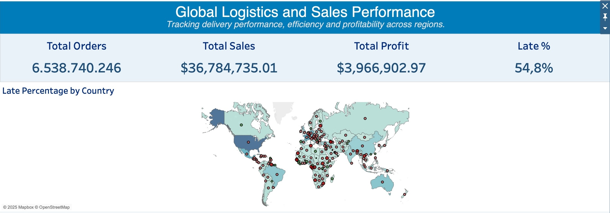

# Global Logistics & Sales Performance  
Leveraging delivery analytics & human-centred insight for supply chain optimisation

---

## 🔧 Tech Stack

| Component                  | Tool                 |
|---------------------------|----------------------|
| Cloud Data Warehouse      | Google BigQuery (SQL)|
| Data Visualisation & BI   | Tableau Public       |
| Version Control           | GitHub               |
| Documentation             | GitHub README.md     |

---

## 📌 KPIs Displayed in the Dashboard

- **Total Orders** – overall demand volume across the network  
- **Total Sales** – commercial performance, by country, segment and time  
- **Total Profit** – profitability signal, not just top-line revenue  
- **Late Delivery %** – core service metric impacting customer experience and retention  

These KPIs anchor the analysis in both **operational performance** and **commercial impact**.

---

## 🧭 Project Overview

In my role as a **Logistics & Customer Experience Analyst**, I supported global shipment performance: tracking on-time delivery, late orders, escalations and customer impact across multiple regions.

Inspired by that work, this project simulates a global logistics environment using a structured dataset and full analytics pipeline. The objective is to demonstrate how **delivery, cost and customer value** can be integrated into a single performance view leaders can act on.

Common challenges from real operations informed the design:

- Delivery performance varies widely across countries  
- Shipping modes differ in cost and reliability  
- High-volume customers are not always the most profitable  
- Late shipments cluster in specific lanes and periods  

> **Core Question:**  
> *Which countries, customer segments and shipping modes are driving late-delivery performance and cost variability — and how can we improve service through data?*

📌 Example: Regions experiencing late shipments  
(red = higher delays, larger bubbles = higher order volume)



---

## 🧱 Methodology — Data Pipeline & Modelling (BigQuery)

1. **Raw Data Import & Staging**  
   - Loaded shipment, order, customer and product tables into **BigQuery**  
   - Created staging tables to handle nulls, invalid dates, and inconsistent country names  

2. **Cleaning & Feature Engineering**  
   Standardised and derived core supply-chain metrics, such as:  
   - On-Time Delivery %  
   - Late Delivery % by country, segment and shipping mode  
   - Cost per unit shipped  
   - Profit per order  
   - Customer segment value indicators  

3. **Summary Tables for BI Layer**  
   Built aggregated tables to keep the Tableau dashboard fast and performant, including:  
   - `summary_customer_segment`  
   - `summary_late_deliveries`  
   - `summary_orders_overtime`  
   - `summary_shipping_efficiency`  
   - `summary_country_mapping`  

4. **Dashboard Build (Tableau)**  
   - KPI banner for Total Orders, Sales, Profit, Late Delivery %  
   - Dual-layer world map (volume + late % overlay)  
   - Shipping-class performance comparison  
   - Time-series view of Sales vs Profit  
   - Customer segment distribution visual

The design balances **high-level executive visibility** with the ability to drill into country, segment and shipping-class patterns.

---

## 🌍 Key Visuals & Insights

### 1. Global Order Volume & Late-Delivery Performance  
**Visual:** Dual-layer world map (bubble size = order volume, colour = Late Delivery %)

**What it shows:**

- Late delivery rates remain elevated across multiple regions — signalling a **systemic issue**, not just isolated markets.  
- High-volume countries with **above-average Late Delivery %** represent the highest-impact improvement opportunities.  
- From a human-centred lens, variation suggests influence from: infrastructure, customs, labour capacity, and distance to key hubs.

---

### 2. Shipping Class Efficiency — Cost vs Service Trade-Off  
**Visual:** Bar chart comparing shipping classes (First Class, Same Day, Standard, Second Class etc.)

**Insights:**

- Faster shipping classes often come with **significantly higher cost per order**, but do not always deliver proportionally better delivery performance.  
- Standard or mid-tier shipping options perform competitively in several regions, indicating potential for **cost optimisation without significant service degradation**.  
- This supports revisiting which customers truly need express service and which can be shifted to more efficient modes.

---

### 3. Customer Segment Value — Orders & Profit  
**Visual:** Donut / bar chart showing Consumer, Corporate, Home Office (or equivalent segments)

**Insights:**

- A small number of segments drive a **disproportionate share of total profit**.  
- Where late deliveries are concentrated in those segments, the **risk to loyalty and revenue is magnified**.  
- Segment-level analysis allows leadership to decide where **service guarantees or premium routing** are most justified.

---

### 4. Time Trend — Sales vs Profit Performance  
**Visual:** Dual-axis monthly line chart (Sales vs Profit)

**Insights:**

- Sales and profit generally move together, but **not always at the same rate**.  
- Some months show high order volume but weaker profit, suggesting:
  - Increased delivery cost  
  - A shift towards less profitable segments  
  - Inefficient shipping-class mix  
- Other months show stable sales with improved profit — indicating **better cost control, routing, or segment mix**.

This helps leaders focus not just on “more orders”, but on **quality of revenue**.

---

## 📉 Data Quality & Operational Risk

Because operational decisions depend on data reliability, the pipeline includes a focus on **data quality**:

| Risk Area          | Mitigation / Handling                                      |
|--------------------|------------------------------------------------------------|
| Null delivery dates| Filtered or flagged for exclusion from SLA calculations    |
| Inconsistent country names | Normalised via mapping tables                      |
| Missing shipping mode | Imputed or classified under "Unknown" for transparency  |
| Cost / profit anomalies | Flagged in summary tables for review                  |

Rather than hiding incomplete data, the model surfaces quality issues as part of **risk awareness**.

---

## 🧩 Recommendations for Leadership

| Business Finding                                         | Recommended Action                                            | Expected Outcome                                   | Metric Focus              |
|----------------------------------------------------------|----------------------------------------------------------------|----------------------------------------------------|---------------------------|
| High sales months with **profit erosion**                | Review shipping-class mix & carrier cost in peak periods      | Lower delivery cost without harming demand         | Profit Margin, Cost/Unit  |
| High-volume countries with **elevated Late Delivery %**  | Prioritise root-cause analysis & process fixes in those lanes | Better customer experience where it matters most   | Late Delivery %, OTD %    |
| Profit concentrated in **few strategic segments**        | Offer tailored SLAs, faster recovery, dedicated support       | Protect recurring revenue from key accounts        | Repeat Orders, Churn Risk |
| Overuse of fastest shipping classes with weak ROI        | Encourage Standard for non-urgent orders                      | Reduced cost-to-serve                              | Avg Cost/Order            |
| Late-delivery spikes aligning with **demand peaks**      | Improve demand forecasting & capacity planning                | More stable delivery performance in peak months    | OTD %, Escalation Volume  |

These actions connect **delivery performance**, **customer outcomes** and **financial results**.

---

## 🚀 Future Enhancements

To further align this analytics asset with real-world logistics operations:

- **Incorporate SLA thresholds explicitly**  
  Segment late performance into: on-track, at-risk, and critical, based on agreed service targets.

- **Carrier-level and lane-level benchmarking**  
  Compare performance and cost across carriers and trade lanes to support commercial negotiations.

- **Geographic drill-down**  
  Move from country-level to regional / city / hub-level performance views.

- **Customer behaviour signals**  
  Include reorder frequency, escalation history and sensitivity to delay.

- **Automated refresh and alerting**  
  Schedule BigQuery → Tableau refreshes; trigger alerts for sustained SLA breaches in priority markets.

---

## 📁 Repository Structure

```text
Global-Logistics-and-Sales-Performance
│
├── README.md
├── sql
│   ├── 01_staging_import.sql
│   ├── 02_cleaning_and_features.sql
│   ├── 03_summary_customer_segment.sql
│   ├── 04_summary_late_deliveries.sql
│   └── 05_summary_orders_overtime.sql
│
├── dashboard
│   └── Global_Logistics_Dashboard.twbx
│
└── Images
    ├── Global_logistics_map.jpeg
    ├── Shipping_Class_Performance.jpeg        (optional/add)
    ├── Customer_Segment_Value.jpeg           (optional/add)
    └── Sales_Profit_Trend.jpeg               (optional/add)


📊 **Interactive Dashboard**

🔗 Tableau Public:
https://public.tableau.com/app/profile/presca.evans/viz/GlobalLogisticsandSalesPerformance/GlobalLogisticsDashboard


👩🏽‍💻 **Author**

Dr. Presca Evans — Data Analyst & Mixed-Methods Researcher
Bridging delivery performance, customer experience and behavioural insight.
Relocating to Brisbane, QLD — Open to data, insights and operations-focused roles.