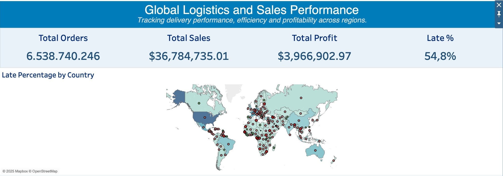
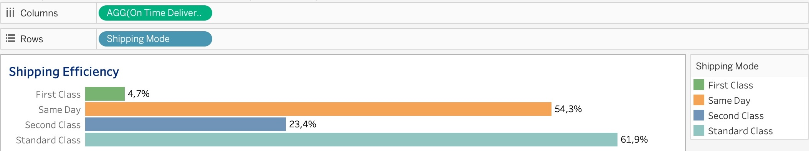

# Global Logistics Service Performance Reporting Pack
Leveraging **service performance analytics** and **reporting BA-style artefacts** to support supply-chain prioritisation decisions.

---

## 👩🏽‍💻 Author
**Presca Wanki** — **Service Performance & Insights Analyst (Reporting BA lens)**  
Focus: KPI definition, reporting requirements, data validation, and performance insights to support service improvement decisions.

---

## ✅ At a glance
- **Decision supported:** Prioritise countries for **OTD** improvement and identify key levers (**Customer Segment / Shipping Class**)
- **Service KPIs:** **Late Delivery %** (primary) + **OTD %** (derived)
- **Tooling:** **BigQuery (SQL)** → **Tableau** → **GitHub documentation**
- **Included:** Requirements + acceptance criteria, KPI glossary, validation rules, dashboard views, recommended actions & success measures

**📊 Tableau Dashboard:**  
https://public.tableau.com/app/profile/presca.evans/viz/GlobalLogisticsandSalesPerformance/GlobalLogisticsDashboard

---

## 📌 KPIs in the dashboard
- **Total Orders** – order-level demand volume (base *N*)
- **Sales** – revenue context by country / segment / time *(dataset assumption)*
- **Profit** – directional profitability indicator to support prioritisation *(dataset assumption)*
- **Late Delivery %** – % of orders delivered **after promised date** (primary service KPI)
- **OTD %** – **100% − Late Delivery %** (derived for readability)

---

## 🔎 Project overview (Service Performance Analyst / Reporting BA lens)

As a **Logistics & Customer Experience Analyst**, I supported global shipment performance by tracking **on-time delivery (OTD)**, late orders, escalations and customer impact across multiple regions.

Inspired by that work, this project uses a **simulated logistics dataset** to demonstrate how leaders can combine **service performance, cost-to-serve and customer value** into a single reporting view for faster prioritisation decisions.

> **Note:** This project uses a **simulated dataset** designed to mirror global shipping performance scenarios. **No confidential Pfizer data** is used.

### Primary users
- **Global Logistics Lead**
- **Customer Experience Lead**

### 5-minute decision this dashboard supports
> **Which countries should we prioritise for OTD improvement — and what levers (segment, shipping class) will move the KPI fastest?**

### Scope & grain
- **Grain:** Order-level *(dashboard uses aggregated summaries for performance)*
- **Required filters:** **Country**, **Customer Segment**, **Shipping Class**

### Core KPI definitions (service)
- **Late Delivery %** = % of orders delivered **after** the promised date  
- **OTD %** = **100% − Late Delivery %** *(derived for readability)*  
- **OTIF note:** “In-Full” is not measured in this dataset; **OTD** is used as the service KPI.

### Why this matters (real-world patterns reflected in the design)
- Delivery performance varies widely across countries  
- Shipping classes differ in cost and reliability  
- High-volume customers are not always the most profitable  
- Late deliveries cluster in specific periods and segments  

📌 **Example visual (map):** *(red = higher delays, larger bubbles = higher order volume)*  


---

## 🔧 Tech stack
| Component | Tool |
|---|---|
| Cloud data warehouse | Google BigQuery (SQL) |
| Visualisation / BI | Tableau Public |
| Version control | GitHub |
| Documentation | README.md |

---

## 🧱 Delivery approach (Requirements → KPI rules → validated model → dashboard)

This project is structured like a **reporting delivery**: define the decision need, confirm KPI rules, validate data quality, then build a dashboard that meets the reporting requirements.

> **Scope note:** This is a **BA reporting deliverable** focused on KPI definition, reporting requirements, validation and decision support. The **SQL/BigQuery layer** is the implementation used to produce trusted metrics.

---

## 1) Reporting requirements (user stories + acceptance criteria)

### User story 1 — Country prioritisation (where to act)
**As a Global Logistics Lead,** I need a ranked view of countries by **Late Delivery %** and **order volume** so I can prioritise OTD improvement initiatives.

**Acceptance criteria**
- Ranking updates based on selected filters (**Country**, **Customer Segment**, **Shipping Class**)  
- Late Delivery % follows the glossary definition (after promised date)  
- Invalid/null promised or delivered dates are **excluded** from KPI calculation and **counted separately** (visible base/exclusions)  
- View shows the **order base (N)** to avoid misinterpretation  

---

### User story 2 — Targeted intervention (which lever moves the KPI)
**As a Customer Experience Lead,** I need to slice Late Delivery % by **Customer Segment** and **Shipping Class** so I can target actions that reduce delays for high-value customers.

**Acceptance criteria**
- Segment and Shipping Class breakdowns use consistent KPI rules across all views  
- “Unknown” Shipping Class is **retained and visible** (not silently dropped)  
- Sales/Profit context is available alongside service performance where relevant  

---

### User story 3 — Early warning (spike vs structural)
**As a Global Logistics Lead,** I need a trend view of Late Delivery % so I can distinguish temporary spikes from sustained deterioration.

**Acceptance criteria**
- Trend uses the same KPI rules as prioritisation (no mismatch)  
- Filters apply consistently and trend remains interpretable by country/segment  
- Trend supports spike vs sustained deterioration interpretation  

---

### User story 4 — Cost vs service trade-off (decision support)
**As a Global Logistics Lead,** I need to compare shipping classes on **Late Delivery % vs Cost-to-Serve vs Profit impact** so I can adjust routing rules without harming service.

**Acceptance criteria**
- Comparison is filterable by country and segment  
- Cost-to-Serve and Profit follow glossary caveats (dataset assumptions noted)  
- “High cost / low benefit” classes are visible to support rule review  

---

### User story 5 — Data trust (transparency)
**As a reporting BA,** I need data quality visibility so stakeholders can trust the service KPI and understand exclusions.

**Acceptance criteria**
- Null/invalid dates handling is stated (flagged + excluded from SLA KPIs)  
- Country naming standardisation prevents double counting  
- Missing Shipping Class is surfaced (“Unknown” category)  

---

### User story 6 — Action focus (operational backlog)
**As a CX Lead,** I need a simple way to turn findings into actions so improvement work is trackable.

**Acceptance criteria**
- “Recommended actions” includes owners and success measures  
- Priority list approach is defined (Top countries by Late % + volume + value context)  

---

## 2) KPI glossary (definitions, grain, rules)

| KPI | Definition | Grain | Caveats / rules |
|---|---|---:|---|
| Late Delivery % | % of orders delivered **after promised date** | Order | Excludes invalid/null promised or delivered dates *(flagged & counted separately)* |
| OTD % | 100% − Late Delivery % | Order | Derived KPI |
| Total Orders | Count of orders | Order | Includes “Unknown” Shipping Class |
| Sales | Total revenue | Order | Based on dataset assumptions |
| Profit | Sales − cost | Order | Cost/profit anomalies flagged for review |
| Cost-to-Serve (proxy) | Service/logistics cost per order (proxy) | Order | Directional comparisons (not accounting-grade costing) |

---

## Limitations & assumptions
- Dataset is **simulated**; results illustrate a repeatable reporting approach rather than real-world Pfizer performance.  
- Cost-to-Serve is a **proxy** based on dataset assumptions; use as directional for comparisons.  
- Service KPI focuses on **OTD** (promised vs delivered date); OTIF “In-Full” is not available in this dataset.  

---

## 3) Data validation & quality handling (trust in the numbers)

| Risk area | Handling approach |
|---|---|
| Null/invalid delivery or promised dates | Flagged and excluded from SLA KPI calculations; counted for transparency |
| Inconsistent country naming | Normalised using mapping tables to prevent double counting |
| Missing Shipping Class | Retained as “Unknown” to avoid hiding issues |
| Cost/profit anomalies | Flagged in summary outputs for review (not silently removed) |

### Quick validation checks (examples)
- Late Delivery % is always between **0% and 100%**  
- Dashboard totals reconcile to summary tables for the same filter set  
- KPI rules are consistent across prioritisation, breakdowns and trends  
- “Unknown” Shipping Class is visible and included in totals  

---

## 4) Build & implementation (BigQuery → Tableau)

### Implementation summary
- Loaded shipment, order, customer and product tables into **BigQuery**  
- Created staging logic to handle nulls, invalid dates, and inconsistent country names  
- Built curated summary tables to keep Tableau performant while preserving order-level logic:  
  - `summary_customer_segment`  
  - `summary_late_deliveries`  
  - `summary_orders_overtime`  
  - `summary_shipping_efficiency`  
  - `summary_country_mapping`  

📌 Summary outputs are exported to `Data Summary/` for transparency and reproducibility.

---

## 5) Dashboard (Tableau)

**Executive layer (fast scan)**
- KPI banner: **Total Orders, Sales, Profit, Late Delivery %, OTD %**

**Prioritisation layer (where to act)**
- Country-level prioritisation view (order volume + Late Delivery %)

**Diagnostics layer (why / which lever)**
- Shipping-class efficiency comparison (cost vs service trade-offs)  
- Segment distribution (value + service exposure)  
- Trend views (spikes vs sustained deterioration)  

---

## 🌍 Key visuals (what to look for)

### 1) Global order volume & late-delivery performance
**Look for:** Priority countries with **high Late % + high volume**  


### 2) Shipping class efficiency — cost vs service trade-off
**Look for:** “High cost / low benefit” classes for routing rule review  


### 3) Time trend — performance stability
**Look for:** Spike-based vs sustained deterioration (different fixes)  


---

## 📌 Key insights + recommended actions (Performance Review Pack)

### Executive summary (what matters)
- **Service risk is concentrated:** A small set of countries drive the largest late-delivery impact (late % + volume).  
- **Cost isn’t always buying reliability:** Some higher-cost shipping classes don’t consistently improve OTD outcomes.  
- **Value exposure exists by segment:** Delays affecting high-value segments create disproportionate customer risk.  
- **Patterns repeat over time:** Trends indicate spike-based vs structural issues — requiring different fixes.

### Recommended actions (practical next steps)
| Action | Owner | Success measures |
|---|---|---|
| Build a Top 5 “Priority Countries” backlog (Late % + volume + value context) | Global Logistics Lead + CX Lead | Late Delivery % reduction in priority countries; reduced repeat late patterns |
| Review shipping-class decision rules in priority countries | Ops Excellence + Carrier/Procurement | Improved OTD at equal/lower cost-to-serve; reduced profit leakage |
| Protect high-value segments during peak periods (prioritisation + proactive comms) | CX Lead + Planning | Late Delivery % improvement for priority segments; fewer customer-impact incidents |
| Run structured root-cause reviews for priority countries | Cross-functional | Sustained improvement over 4 weeks post-fix; fewer repeat exceptions |

### Controls & governance (so leadership trusts the numbers)
- Data quality exclusions are explicit (invalid/null dates flagged and excluded from SLA KPIs)  
- Country naming is standardised to prevent inconsistent rollups  
- “Unknown” Shipping Class is retained and visible for transparency  

### KPIs to monitor weekly
**Service:** Late Delivery %, OTD % (overall + priority countries), Late % by segment & class  
**Operational:** volume in priority countries, repeat late patterns  
**Commercial:** profit/cost movement by shipping class, value-segment exposure  

---

## 🚀 Future enhancements
- Add explicit SLA thresholds (on-track / at-risk / critical) to support early warning  
- Add carrier benchmarking (if carrier fields available) to support negotiation and accountability  
- Extend drill-down to regional/hub-level views (if geography fields available)  
- Add customer behaviour signals (e.g., reorder frequency, escalation sensitivity)  
- Automated refresh + alerting (BigQuery → Tableau schedule + sustained breach alerts)

---

## 📁 Repository structure

```text
Global-Logistics-and-Sales-Performance/
├── README.md
├── LICENSE
├── Images/
│   ├── Global_logistics_map.jpeg
│   ├── Shipping_Class_Efficiency.jpeg
│   └── Sales_Profit_Trend.jpeg
├── SQL Scripts/
│   ├── (staging + cleaning + summary table SQL scripts)
│   └── ...
└── Data Summary/
    ├── summary_country_mapping.csv
    ├── summary_customer_segment.csv
    ├── summary_late_deliveries.csv
    ├── summary_orders_overtime.csv
    └── summary_shipping_efficiency.csv